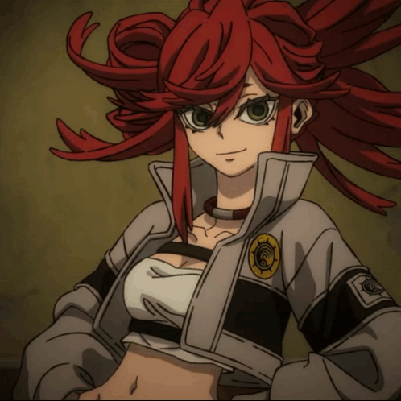

# Q, я ANTON SVD 👋

[](https://git.io/typing-svg)


<p align="center">
  
</p>

---

## 🛠 Языки и технологии

[](https://skillicons.dev)

---

## 📊 Статистика GitHub

[]()

[]()

---

## 🚀 Мои проекты

[]()
[]()
[]()

---

## 🏆 Достижения

[]()

---

## 📈 График активности

[]()

---

## 🐍 Снейк-вклад

<p align="center">
  
</p>

---

## 📬 Контакты

[](https://discord.com/users/antonsvdhk)
[](https://steamcommunity.com/profiles/76561199247051873)
[](https://t.me/ANTONSVD)

---

<details>
<summary>👀 Немного обо мне в цифрах</summary>

```cpp
struct Me {
    const char* name       = "ANTON SVD";
    const char* role       = "GameHacking Developer";
    std::vector<const char*> languages = { "Lua", "C", "C++", "Python", "JS" };
    const char* focus      = "Reverse Engineering & Exploits";
    const char* favorite_quote = "Client is not always right.";
};
```
</details>

*README обновляется по мере того, как растёт мой репозиторий 🚀*
